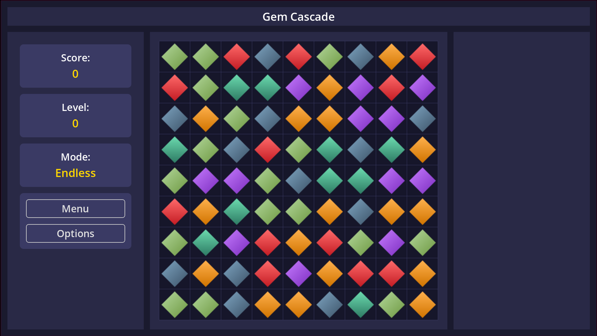

# GemCascade

A modern implementation of the classic match-3 puzzle game in Godot Engine.



## About the Game

GemCascade is a grid-based puzzle game where players match gems of the same type to score points and create special gems with powerful effects. The game features an 8x8 grid filled with colorful gems, chain reactions, and various game modes to engage players in addictive puzzle gameplay.

### Core Gameplay

- Swap adjacent gems to create matches of three or more identical gems
- Matched gems disappear, causing gems above to fall and new gems to appear
- Create special gems by matching four or more gems in specific patterns
- Chain reactions and cascades provide bonus points
- Play in Classic mode until no valid moves remain

## Project Architecture

GemCascade uses a component-based architecture where distinct responsibilities are separated into specialized components that communicate via signals. This architecture makes the codebase more maintainable, testable, and extensible.

### Component Structure

The game is built around the following key components:

#### GridManager
- Handles grid creation and coordinate management
- Manages the 8x8 game board structure
- Converts between grid and pixel coordinates
- Renders grid visualization

#### GemManager
- Manages gem creation and properties
- Handles gem type differentiation
- Controls initial board population
- Implements gem pooling for performance

#### InputHandler
- Processes player input and gem selection
- Manages gem highlighting and selection states
- Validates swap attempts between gems
- Provides feedback for valid/invalid moves

#### MatchDetector
- Identifies valid matches on the board
- Detects horizontal and vertical matches
- Finds special patterns (L, T shapes)
- Marks gems for removal after matching

#### BoardController
- Manages board state and gem movements
- Controls gem falling mechanics
- Handles board refilling
- Processes turn sequences and cascades

#### ScoreManager
- Tracks and displays player score
- Calculates points based on match types
- Shows score animations and feedback
- Manages high score tracking

### Signal-Based Communication

Components communicate through a signal system that promotes loose coupling:

```
InputHandler → signals gem selection → BoardController
MatchDetector → signals matches found → BoardController
BoardController → signals score update → ScoreManager
```

## Setup Instructions

### Requirements

- Godot Engine 4.0 or higher

### Installation

1. Clone this repository
2. Open the project in Godot Engine
3. Open the main scene (`scenes/game/GameBoard.tscn`)
4. Press F5 or click the Play button to run the game

## Development Roadmap

The project is currently entering Sprint 3, which will focus on:

- Special gem implementation (line-blast, color-bomb)
- Special gem effects and combinations
- Advanced match patterns (L, T, + shapes)
- Classic mode implementation
- Score tracking enhancements

Future plans include:
- Timed mode implementation
- Endless/Zen mode
- Progressive difficulty system
- Additional special gem types
- Achievements system
- User profiles and high scores

## Project Structure

```
scenes/
  game/
    components/
      GridManager/
      GemManager/
      InputHandler/
      MatchDetector/
      BoardController/
      ScoreManager/
    GameBoard.tscn  # Main game scene
resources/
  assets/
    gems/           # Gem sprites
    ui/             # UI elements
    effects/        # Visual effects
  audio/
    music/          # Background music
    sfx/            # Sound effects
scripts/
  utils/            # Utility classes and functions
```

## Credits

Developed by [Lorenz B.]

---

© 2025 [Kalgorian Game Studio]
